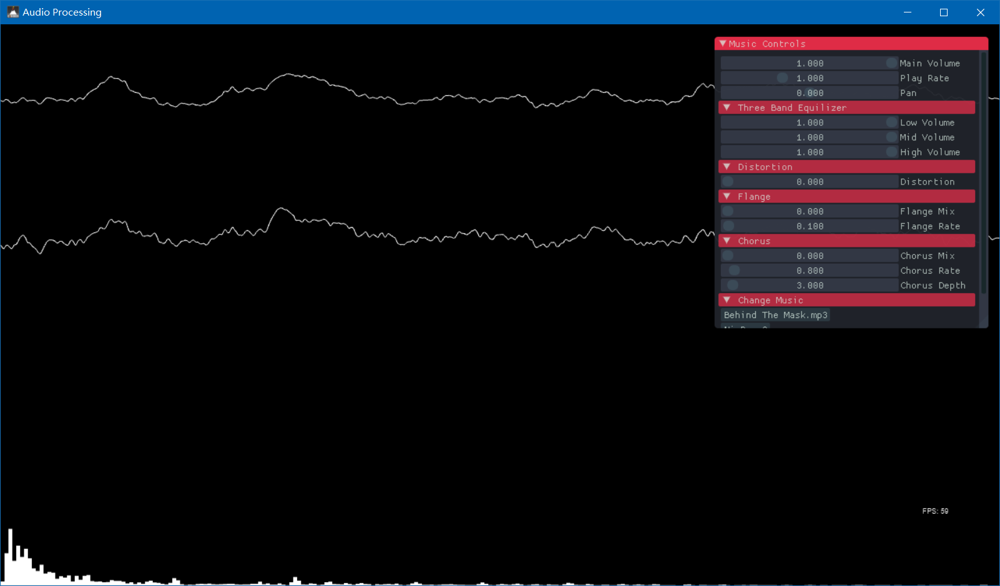

This is a simple desktop real time music processing application. It's powered by Cinder, FMOD and Dear Imgui.

# Features

Volume, pitch, pan, 3-band equalizer, distortion, flange, chorus and changing music.

# TODO

1. support for Intel Realsense depth camera
2. more awesome visualization besides fft
3. more audio processing effects